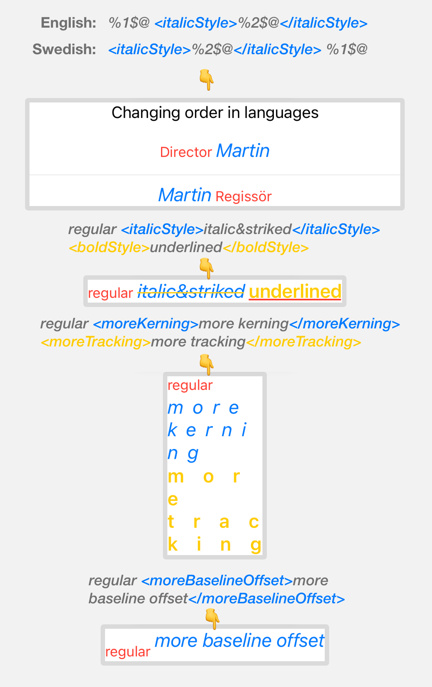

<p align="center">

</p>

XMLText is a mini library that can generate SwiftUI `Text` from a given XML string with tags. It uses `+` operator of `Text` to compose the final output.

```
Text(
    xmlString: "my <bold>localized</bold> and <italic>styled</italic> string",
    styleGroup: myStyleDefinitions
)
```

***The original idea comes directly from [`SwiftRichString` library by `Daniele Margutti` on GitHub](https://github.com/malcommac/SwiftRichString). Code for XML parsing, StyleProtocol, and StyleGroup are taken from this library, slight modifications are made to them in order to generate `SwiftUI` `Text` instead of `NSAttributedString`.***

This is really useful for localising your apps for styled strings without having to know the location of the strings in the code that needs to be styled. This is a pretty fine alternative to having to use `NSAttributedString` with `UIViewRepresentable` of a `UILabel` in a `SwiftUI` app, as the layout of `UIViewRepresentable` for such dynamic views as `UILabel` doesn't always work and is prone to glitches when combined with other `SwiftUI` views.

## Examples
<p align="center">

</p>

<p align="center">
iOS 14.0 / macOS 11.0 / tvOS 14.0
</p>

## Supported `Text` modifiers

#### font(*SwiftUI.Font*)
#### foregroundColor(*Color*)
#### strikethrough(*Color*)
#### underline(*Color*)
#### kerning(*CGFloat*)
#### tracking(*CGFloat*)
#### baselineOffset(*CGFloat*)

## Sample usage

This is an example of XML strings that would appear in your Localizable.strings files with words in different order for each different language, namely English and Swedish for this example.
If you are not familiar with that approach, please note that the style information(`StyleGroup` keys, e.g. `<italicStyle>`) is also contained in the localized strings.


```
// This goes to English Localizable.strings
let englishXML = "%1$@ <italicStyle>%2$@</italicStyle>"

// This goes to Swedish Localizable.strings
let swedishXML = "<italicStyle>%2$@</italicStyle> %1$@"

let normalStyle = Style { style in
	style.font = .subheadline
	style.foregroundColor = .red
}

let italicStyle = Style { style in
	style.font = Font.italic(.system(size: 20))()
	style.foregroundColor = .blue
}

let styleGroup = StyleGroup(
	base: normalStyle,
	["italicStyle": italicStyle]
)

Text(
	xmlString: String(format: englishXML, "Director", "Martin"),
	styleGroup: styleGroup
)
Text(
	xmlString: String(format: swedishXML, "Regissör", "Martin"),
	styleGroup: styleGroup
)
```

### 🔗 Links (not supported)

It is currently not supported in `SwiftUI` to combine other `View`(e.g. `Button`) elements with `Text` elements using `+` operator.

Adding tap gesture recognizer to individual parts of `Text` while using `+` operator is also not supported, as gesture recognizer modifiers return an opaque type of `View`, which means it is not `Text` anymore, then it can't be added to other `Text`.
 
If you have only one link within a given paragraph or sentence, consider getting away with adding a tap gesture recognizer to the whole `Text` of paragraph or sentence which is generated via `XMLText` library.

If you have multiple links within the same sentence or paragraph, good luck with `NSAttributedString` and `UIViewRepresentable` of a `UITextView`. 🤷‍♂️

### 🎆 Images (not supported)

Similar to links, it is currently not supported in `SwiftUI` to combine `Image` elements with `Text` using `+` operator.

### Custom XML Attributes (not supported)

For example: `<italicStyle myAttribute="something"></italicStyle>`

This is currently not supported for sake of simplicity and given the fact that the library doesn't have so many capabilities for that to make sense. If there would be some use cases regarding this, a similar approach to `XMLDynamicAttributesResolver` of `SwiftRichString` library could be considered in the future.